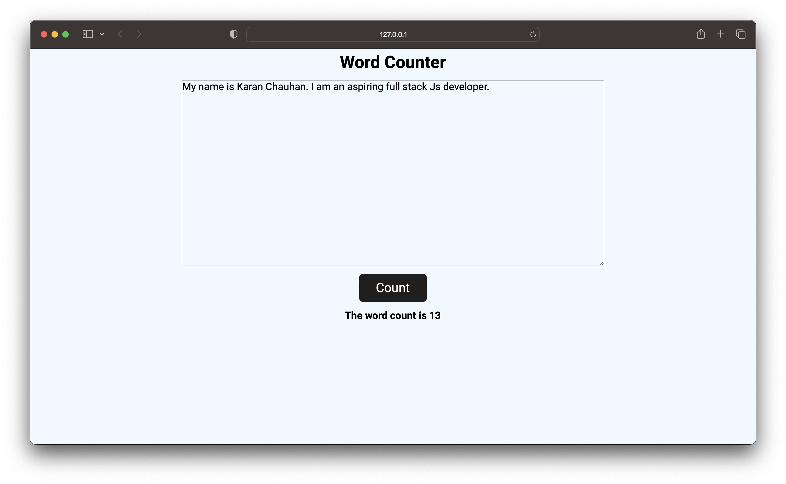

### Word Counter using vanila Javascript

>In this project, a input field is given and on pressing the count button it returns the number of the word in the input.

## live link - [click here](https://wordcounter-js-karanch.netlify.app)

## Time taken - 1hrs

### Screenshots 

